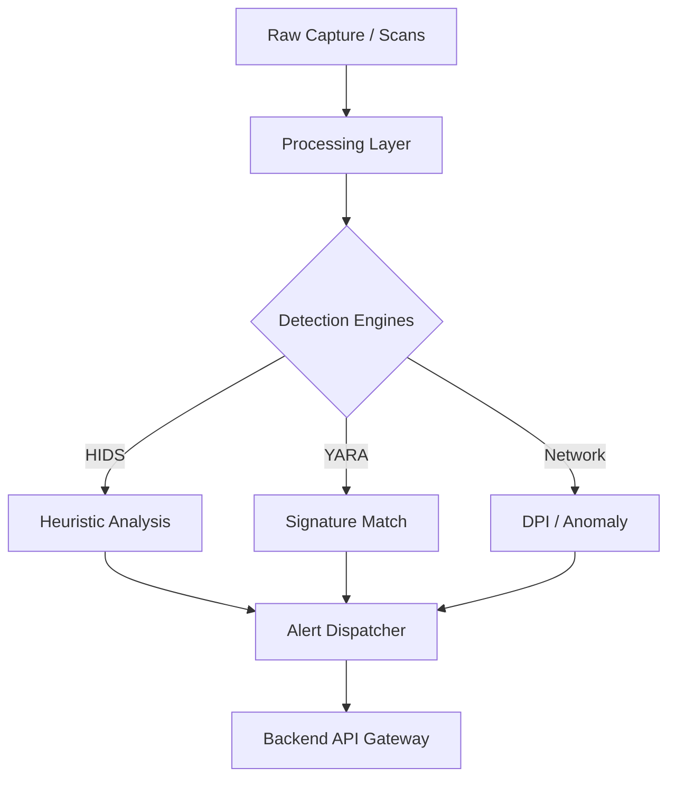

# 🛡️ TechzazEDR Security Agent

[](#)
[](#)

A high-performance, consolidated threat detection engine. The TechzazEDR Agent combines Host-based Intrusion Detection (HIDS), Malware Scanning, and Network Traffic Analysis into a single, modular toolkit that streams real-time telemetry to the Management Console.

---

## 🛡️ Detection Engines

### 1. HIDS (Host-based Intrusion Detection)
- **Masquerading Detection**: Flags system binaries (e.g., `lsass.exe`, `svchost.exe`) executing from untrusted paths like `%TEMP%` or `%APPDATA%`.
- **Persistence Watcher**: Scans critical Windows Registry keys (`Run`, `RunOnce`) for unauthorized entries.
- **Path Heuristics**: Monitors high-risk directories for suspicious executable attributes and naming patterns.

### 2. File & Signature Scanning
- **YARA Integration**: Native support for **YARA 4.2+** rules. Scans live memory and the filesystem for complex malware signatures.
- **Artifact Analysis**: Identifies "Double Extension" spoofs (`.pdf.exe`) and hidden executable content.
- **Entropy Checks**: (In Development) Identifying packed or encrypted malicious payloads.

### 3. Network Anomaly Detection (DPI)
- **Protocol Analysis**: Detects TCP flag anomalies (XMAS, NULL scans) using raw socket capture.
- **Exfiltration Monitoring**: Volume-based alerting for suspicious data transfers.
- **DNS Guard**: Detects DGA (Domain Generation Algorithms) used for C2 communication.



---

## ⚙️ Configuration (`config.json`)

| Field | Description |
| :--- | :--- |
| `OrganizationApiKey` | Your unique key from the Dashboard to link alerts to your tenant. |
| `BackendUrl` | API endpoint for alert ingestion (Default: `https://techzazedrdashboard-backend-production.up.railway.app`). |
| `YaraRulesPath` | Directory containing your `.yar` signature files. |
| `UntrustedExecutionPaths`| List of directories monitored for masquerading binaries. |

---

## 🚀 Execution

### Prerequisites
- **.NET 10.0 SDK**
- **Npcap**: Required for raw network packet capture.
- **Admin Privileges**: Required for registry and network monitoring.

### 1. Automated Setup (Recommended)
1. Log in to the **TechzazEDR Dashboard**.
2. Navigate to **Endpoints** and click **Download Bootstrap Script**.
3. Run the generated `.ps1` script as **Administrator** on the target endpoint.
4. The agent will automatically configure itself with the correct `OrganizationApiKey` and `BackendUrl`.

### 2. Manual Execution
```bash
dotnet run
```

### Main Menu
1. **Full System Scan**: Immediate triggers for HIDS and YARA engines.
2. **Network Analyzer**: 60-second live capture with automated DPI.
3. **Unified Mode**: Continuous background telemetry streaming while performing local scans.

---

## 📑 Adding Custom Rules

### YARA Rules
Place `.yar` files in the configured `YaraRulesPath`. The agent will automatically include them in the next scan cycle.

```yara
rule Suspicious_Temp_Exec {
    strings:
        $a = "magic_string"
    condition:
        $a and filepath contains "Temp"
}
```

---

## 🛠️ Troubleshooting

- **"Interface not found"**: Ensure **Npcap** is installed in "WinPcap API-compatible Mode".
- **"Access Denied"**: Critical security engines require an **Elevated Command Prompt (Admin)**.
- **Alerts Missing**: 
  - Verify the `OrganizationApiKey`.
  - Check the `BackendUrl` connectivity.
  - Inspect `alerts.log` for ingestion errors.

---
> [!CAUTION]
> This agent performs deep system monitoring. Use only on authorized endpoints.
